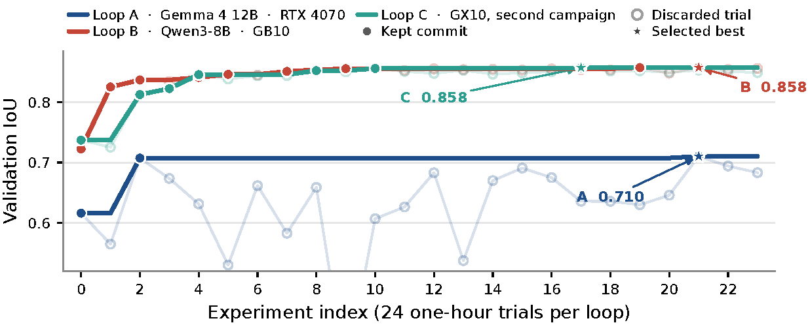

# Investigation of Autoresearch for Solar Panel Segmentation

## Setup

AutoResearch is not a new segmenter. A coding agent may edit only the training program; the split, evaluator, and DeepLabV3–ResNet-50 architecture stay frozen. Each idea is trained for 3600 s. A change is **retained** if validation IoU improves, otherwise the tree is reset. Each campaign is capped at 24 experiments, including the baseline.

Data follow Lekavičius and Gružauskas, *Energies* (2024): 2048 / 256 / 256 real images (PV08, PV03, IGN, PV01+Google), no pix2pix extras. The test split is scored once, after Loop B.

## Figure

Validation IoU over the three campaigns. Solid lines are the running best (selected trajectory). Transparent markers are rejected trials. Stars mark the selected best of each campaign.

## Tables

### Table 1. Three AutoResearch campaigns

Architecture, split, seed, and a 3600 s training budget are shared. Loops A and C are not evaluated on the held-out test set.

| | Loop A | Loop B | Loop C |
|---|---|---|---|
| Coding model | Gemma 4 12B | Qwen3-8B | GX10 campaign |
| GPU | RTX 4070 12 GB | NVIDIA GB10 | GX10 (GB10) |
| Batch / peak VRAM | 2 / ≈9 GB | 8 / 18–35 GB | 8→16 / 35–36 GB |
| Baseline val. IoU | 0.616 | 0.723 | 0.737 |
| Best val. IoU | 0.710 | 0.858 | 0.858 |
| Δ val. IoU | +0.094 | +0.135 | +0.120 |
| Retained / rejected | 3 / 21 | 10 / 14 | 7 / 17 |
| Best test IoU / F1 | — | **0.836 / 0.891** | — |

### Table 2. Overlapping modification families

Deltas are versus the configuration on which the change was stacked. **Retained** means the commit became the new incumbent.

| Modification family | Loop A | Loop B | Loop C |
|---|---|---|---|
| Soft Dice (+BCE) | rejected | **retained** +0.103 | **retained** +0.076 |
| Cosine schedule | **retained** +0.092 | rejected | rejected |
| Polynomial LR 0.9 | rejected | **retained** +0.012 | — |
| AdamW vs. Adam | rejected | **retained** +0.005 | — |
| Auxiliary head ×0.4 | rejected | **retained** +0.004 | — |
| Gradient clip 1.0 | rejected −0.359 | **retained** +0.002 | — |
| Horizontal flip | rejected | **retained** +0.005 | rejected, then retained |
| Lower peak LR | rejected 3×10⁻⁴ | rejected | **retained** |
| Larger batch | — (12 GB) | — | **retained** 8→12→16 |
| Color jitter | rejected | rejected | **retained** +0.001 |
| Rotation / freeze / EMA | rejected | rejected | rejected |

The two GX10 campaigns reach the same validation IoU of 0.858 with different retained sequences. That is consistent with a one-hour plateau on this backbone and split, not with a unique AutoML default.

### Table 3. Comparison with Lekavičius and Gružauskas (2024), Table 5

Same 256 test images. The comparison is not matched for compute: the reference trains for up to 100 epochs on an A100; Loop B trains 3600 s on 2048 real images. Loops A and C are validation-only.

| Setup | Data | Budget | IoU | F1 |
|---|---|---|---:|---:|
| Paper `no_aug` | real | ≤100 ep. (A100) | 0.801 | 0.853 |
| Paper `basic_aug` | real | ≤100 ep. (A100) | 0.813 | 0.865 |
| Paper `gan60` (paper best) | real + 60% GAN | ≤100 ep. (A100) | 0.833 | 0.880 |
| Loop C best (val.) | real | 3600 s (GX10) | 0.858† | — |
| Loop B best (val.) | real | 3600 s (GB10) | 0.858† | 0.908† |
| **Loop B best (test)** | **real** | **3600 s (GB10)** | **0.836** | **0.891** |

† Validation split; not comparable to the paper’s test rows.

## Funding

This research has received funding from the Research Council of Lithuania (LMTLT), agreement No S-ITP-25-3.

## Reference benchmark

Lekavičius, J. and Gružauskas, V. (2024). Data augmentation with generative adversarial network for solar panel segmentation from remote sensing images. *Energies*, 17(13):3204. https://doi.org/10.3390/en17133204
